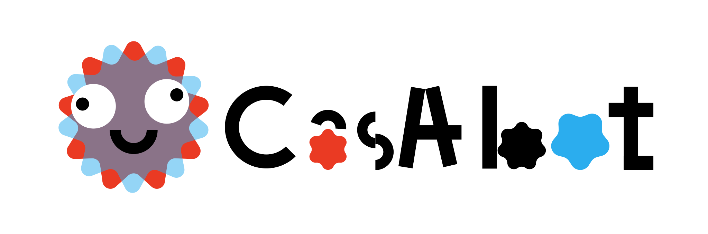

<p align="center">
  
</p>

# CasAbot

> **Cassiopeia A** — Create anything freely, like a supernova explosion.

A skill-driven multi-agent orchestrator system. The base agent reads skill documents, spawns sub-agents, and delegates all tasks through them.

## Installation

```bash
npm i -g casabot
```

## Getting Started

```bash
# Initial setup (select provider and model)
casabot setup

# Open the TUI chat interface
casabot

# Reset to default configuration
casabot reset
```

## Core Philosophy

- **Skills are everything** — The base agent doesn't hardcode any logic. It reads skill documents (SKILL.md) and executes them via the terminal. Need a new capability? Just add a skill document.
- **Base doesn't do the work** — The base agent is purely an orchestrator. It never performs tasks directly — it delegates everything to sub-agents.

## Architecture

```
User ↔ TUI (Terminal UI) ↔ Base Agent (terminal access)
                               │
                               ├── Read skill documents
                               ├── Execute terminal commands
                               │
                               ├── Sub-agent A (podman container)
                               │     └── Own workspace + tools
                               ├── Sub-agent B (podman container)
                               │     └── Own workspace + tools
                               └── ...
```

## Directory Structure

```
~/casabot/
├── casabot.json          # All configuration (providers, models, etc.)
├── skills/               # Skill documents (AgentSkills standard)
│   ├── agent/SKILL.md    # Agent creation and management
│   ├── config/SKILL.md   # CasAbot configuration
│   ├── chat/SKILL.md     # Conversation management
│   ├── service/SKILL.md  # System service registration
│   ├── memory/SKILL.md   # Memory management
│   └── subskills/SKILL.md # Sub-agent skill attachment and management
├── workspaces/           # Per-agent workspaces
├── history/              # Full conversation logs (raw)
└── memory/               # Agent-authored notes (.md)
```

## Supported Providers

| Provider | Type |
|----------|------|
| OpenAI | `openai` |
| Anthropic | `anthropic` |
| Hugging Face | `huggingface` |
| OpenRouter | `openrouter` |
| Custom (OpenAI-compatible) | `custom-openai` |
| Custom (Anthropic-compatible) | `custom-anthropic` |

## Built-in Skills

| Skill | Description |
|-------|-------------|
| `agent` | Create, delegate to, and manage podman-based sub-agents |
| `config` | CasAbot configuration structure and modification |
| `chat` | Conversation session management and search |
| `service` | systemd service registration and automation |
| `memory` | Write, query, and search agent notes |
| `subskills` | Attach and manage skills available to sub-agents |

## Adding Skills

Create a directory under `~/casabot/skills/` and write a `SKILL.md` file:

```yaml
---
name: skill-name
description: What this skill does
metadata:
  casabot:
    requires:
      bins: []
---

# Skill Title

(Instructions for the base agent to read, interpret, and execute via terminal)
```

## Tech Stack

- **Runtime**: Node.js
- **Language**: TypeScript
- **TUI**: [Ink](https://github.com/vadimdemedes/ink) (React for CLI)
- **Containers**: podman
- **LLM SDKs**: OpenAI, Anthropic

## License

Apache License 2.0 — see [LICENSE](./LICENSE)
